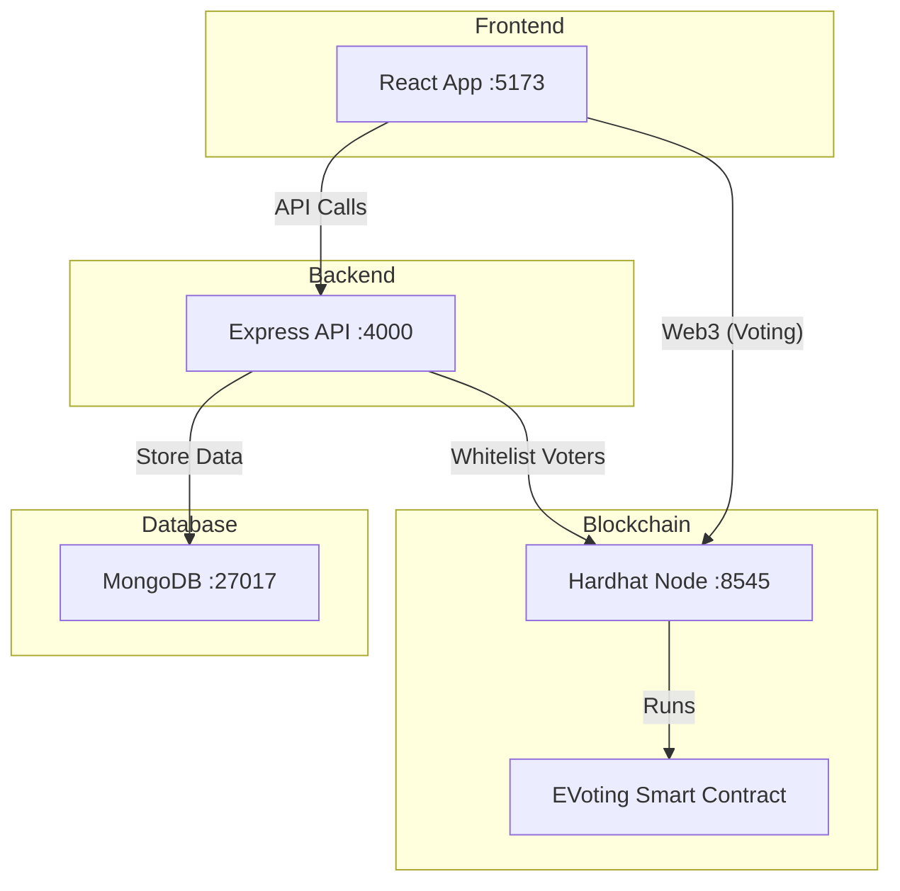

# System Architecture & Design

This document details the internal workings, security layers, and data structure of the E-Voting system.

## 🏗️ High-Level Overview

The system consists of three main components interacting as follows:

---

## 🔄 Complete Data Flows

### Admin: Registering a Voter
1. Admin creates a voter (Name/ID) in the Frontend.
2. Backend generates a 6-digit code, hashes it (SHA-256), and stores it in **MongoDB**.
3. Admin shares the code with the voter.

### Voter: Linking & Whitelisting
1. Voter enters their code and allows the Frontend to access their **MetaMask** address.
2. Backend verifies the code hash and links the wallet address to the voter in MongoDB.
3. Admin triggers the **Whitelist** action.
4. Backend calls the Smart Contract's `whitelistVoter` function.
5. Smart Contract adds the address to its `allowedVoters` mapping on the blockchain.

### Voter: Casting a Vote
1. Voter selects a candidate and signs a transaction via MetaMask.
2. The Smart Contract verifies:
   - Is the sender whitelisted?
   - Has the sender already voted?
   - Is the candidate ID valid?
3. If all checks pass, the vote is recorded on-chain and any further attempts to vote are rejected.

---

## 🛡️ Security Architecture

The system implements security across three distinct layers:

### Layer 1: Database Integrity
- **One-time codes**: Hashed before storage; cannot be reversed if the DB is compromised.
- **Unique Identifiers**: Prevents duplicate registration for the same student ID.
- **Usage Timestamps**: Ensures codes are used once and within a valid timeframe.

### Layer 2: Backend Validation
- **Admin Authentication**: All management actions require a secure session.
- **State Verification**: Backend ensures a wallet is properly linked before allowing whitelisting.
- **Audit Logging**: Every action is logged in an `auditlogs` collection for accountability.

### Layer 3: Blockchain Immutability
- **Permissioned Access**: Only the contract owner (admin) can add voters to the whitelist.
- **One-Wallet-One-Vote**: Enforced by the code logic at the EVM level.
- **Auditability**: Every vote generates an event that can be independently verified.

---

## 📊 Database Schema (MongoDB)

### Collection: `eligiblevoters`
| Field | Type | Description |
| :--- | :--- | :--- |
| `name` | String | Voter's name |
| `universityIdOrEmail` | String | Unique student identifier |
| `codeHash` | String | SHA-256 hash of the issued code |
| `walletAddress` | String | Linked MetaMask address |
| `whitelistedAt` | Date | Timestamp of whitelisting |

### Collection: `auditlogs`
| Field | Type | Description |
| :--- | :--- | :--- |
| `action` | String | e.g., "CREATE_VOTER", "ISSUE_CODE" |
| `actor` | String | e.g., "admin", "voter" |
| `details` | Object | JSON payload of the action |

---

*Made with ❤️ by Ahmed Mekled*
